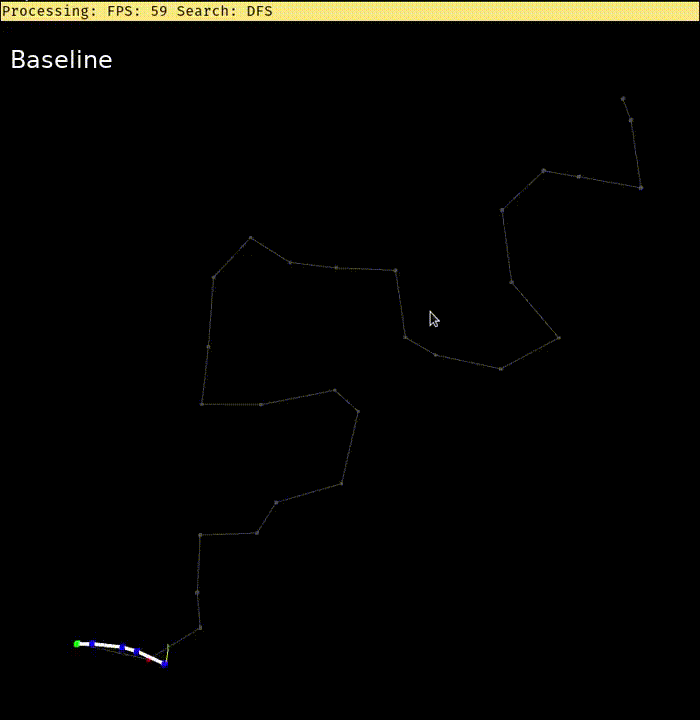
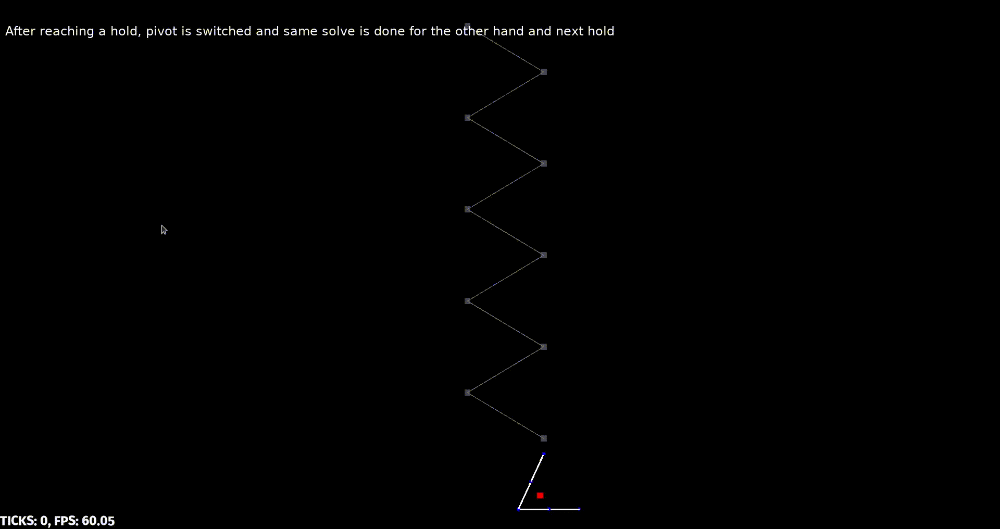

# stick-solo

## description
- Simple planning methods for 2D stick-figure free-solo climbing agents.
- This work illustrates hierarchical control.
    - Limb-end level control: Using neural network as policy, which is optimized using cross-entropy method.
    - Inverse-kinematics level control: Using random sampling based near global solves + gradient descent based snapping to goal.

### Assumptions
- 2D wall and 2D constrained stick-figure agents.

### Chain agent
- Rigid links + revolute joints.
- Links arranged serially.
- N links <=> N joints <=> N sized joint tuple <=> N + 1 ends.
- Always one pivot end and one free end.

### Pinned Chain couple agent
- Two Chain agents connected end to end.
- Always one holding end and one free end.
- The holding Chain's free end determines non-holding Chain's pivot at any instant.

## code
- Code is written in `rust`. Some of features used were in `nightly` stage at the time of writing this.
    - `.cargo/` contains cargo config, especially linker and generic sharing config for speedy iterative compilations.
    - `assets/` contains game assets.
    - `latex/` contains latex literature produced including proposal, update and report.
    - `plotting/` contain matlab script for plotting.
    - `src/` contains all source code.

## usage
- Use `cargo +nightly run --release --bin <bin crate>` to run a bin crate.
- Common controls
    - `w a s d` and `i j k l` for goal control.
    - `- +` for camera zoom in and out movements.
    - `arrow keys` camera panning.

## demonstration
### bin crates
- `gd_*` - illustrates vanilla gradient descent ik control for Chain agent as two limb agent.
- `relax_gd_transfers` - illustrates relaxing heuristic + gradient descent ik control for Chain agent as two limb agent.
- `nprs_gd_*` - illustrates no prior random sampling + gradient descent ik control for Chain agent as two limb agent.
- `csrs_gd_*` - illustrates current state random sampling + gradient descent ik control for Chain agent as two limb agent.
- `ohc_reach_manual` - illustrates (manual neck control) + (no prior random sampling + gradient descent ik control) for Pinned Chain couple agent as two limb agent.
- `ohc_reach_ceo` - illustrates (optimizing a network for neck control using cross entropy method) + (no prior random sampling + gradient descent ik control) for Pinned Chain couple agent as two limb agent.
    - Seperate networks are independently optimized left holding and right holding cases.
    - After training for a case the optimized network is written to a file.
- `ohc_transfers` - illustrates (network neck control) + (no prior random sampling + gradient descent ik control) for Pinned Chain couple agent as two limb agent.
    - It takes two command line arguments, path to neural network file for left case and right case respectively.
    - Given these two networks, depending on current case it uses appropriate network to control neck.
- `ohc_plot` and `plotting/plot3d.m` are used together for analyzing and plotting some graphs for a given optimized neural network.

### features

| Gradient descent IK control | Neural network IK control |
| --- | --- |
|  |  |
| Has smooth control | Has noisy control and difficult to train generally |

Therefore direct neural-network IK control is not used.

- Baseline.




- New system intro.


- Effect of center of mass term in gradient descent IK.


| Local minima problem | Its solution |
| --- | --- |
|  |  |

| Cartwheeling problem | Its solution |
| --- | --- |
|  |  |

- Due to inherent usage of randomness, different motion is produced for same scenarios.


- Switching pivot to continue on a path.



- Failure case of switching pivot.


- Matching hands (when needed) + switching pivot solves the problem.


- Chain as two limb agent on a climbing route: Vanilla gradient-descent control.


- Chain as two limb agent on a climbing route: Relax on every hold + gradient-descent control.


- Chain as two limb agent on a climbing route: No-prior random-sample near-global solve + gradient-descent snapping control.


- Chain as two limb agent on a climbing route: Current-state random-sample near-global solve + gradient-descent snapping control.


- Large N with small lengths can model a worm.


- Pinned Chain couple as two limb agent.
    - Manual neck and reaching hand goal control.
    - No-prior random-sample near-global solve + gradient-descent snapping IK control.


- Pinned Chain couple as two limb agent.
    - Holding with left arm.
    - Manual reaching hand goal control.
    - Cross-entropy optimized network neck control.
    - No-prior random-sample near-global solve + gradient-descent snapping IK control.


- Pinned Chain couple as two limb agent.
    - Holding with right arm.
    - Manual reaching hand goal control.
    - Cross-entropy optimized network neck control.
    - No-prior random-sample near-global solve + gradient-descent snapping IK control.


- Visualizing neural network policy for neck using texture map distortion method.
    - Input to network is lengths of agent links and reaching hand goal.
    - Output is neck goal.
    - Since for a given agent lengths are fixed, policy is a map from R^2 -> R^2.
    - Left map shows original texture with linear mapping y = x.
    - Right map shows texture distorted using policy y = f(x).


- Cross-entropy optimization can be parallelized. Time taken for optimization is shown for number of CPU cores.


- Pinned Chain couple as two limb agent.
    - Manual reaching hand goal control (derived from given path).
    - Cross-entropy optimized network neck control.
    - No-prior random-sample near-global solve + gradient-descent snapping IK control.


## roadmap
- Problems solved until now are documented in `report.pdf`.

```
My game my rules ----------------- Physical Simulator --------------------- Real world
                        |
                current project
```

- Idea for human like stick figure agent.
    - [x] IK for each limb.
    - [x] Co-ordinate among limbs.
    - [x] With q contrains.
    - [x] Put center of mass over holds.
    - [x] Do what all climb cycle agent can and more.
    - [x] High level planner.

| act/plan           | per limb ik | q constraints | multi limb co-orindation | com over holds |
| ---                | ---         | ---           | ---                      | ---            |
| 1 Chain               | done        | done          | N/A                      | done           |
| Pinned 2 Chain   | done        | done          | done                     | done           |

- Tried networks.
    - [x] Chain: ls, qs, goal input -> delta_qs.
    - [x] Chain: xis, yis, goal input -> delta_qs.

- [x] Switching Chain agent (2 limb as Chain).
    - [x] q clamps.
    - [x] delta q abs clamp.
    - [x] Local optimal JT control.
    - [ ] Local optimal pseudo inverse control.
    - [x] Local com control.
        - [x] Implement COMx control.
            - [x] delta_q1 = 2 * x_c * dx/dq1; not = dx/dqq; i.e. min x_c^2 not x_c.
            - [x] Discounted com control for q_i by 1 / i.
            - [x] Sending com to origin vs origin + goal / 2. Can actually send anywhere.
            - [x] Optimized calculation.
        - [x] COMy control. push com_y downward.
            - [x] Optimized calculation.
        - [x] Local maxima problem ys = 0. (very rare problem since other controls are generally involved.).
        - [x] Heuristics to model powering through (adrenaline).
            - [x] gaussian randomized end control (sometimes the weight is > 1 modelling overpower).
            - [ ] Smoothen this to produce periodic spurs of energy (maybe perlin noise).
        - [ ] Powerful vs balanced tuning.
    - [x] Arbitrarily global optimal control (Random sample solve and interpolate control).
        - From the spirit of RANSAC.
        - Given end effector goal, randomly sample q vector (in q clamps range) and keep the q\* which achieves closest approach.
        - This at limit should not be stuck at local minima. Therefore is bit different from gradient descent.
        - These iterations can be stopped after a fixed number of samples or if closest approach is less than a threshold.
        - Given q\* just interpolate from current q to q\*.
        - Parallelizable.
    - [x] Arbitrarily global optimal control (Cross-entropy solve and interpolate control).
        - From the spirit of CEO.
        - Improvement. Instead of sampling randomly in whole q clamp, sample in small region around q, take the best q\*, then sample in vicinity of q\* and so on.
        - More prone to local minima but given enough big sampling region local minima can be avoided.
    - [x] Global optimal planning (Solving local planning minumum problem. Agents get stuck due to them even for cases where there is a solution).
        - [x] 1. Heuristics to reduce local minima.
            - relaxation time (theoretically guaranteed local minima problem solve given enough relaxation time).
        - [x] 2. View it as a two link chain (decrease degree of freedom) (Don't want to implement now).
        - [x] 3. Random global optimal solve.
        - [x] 4. Cross entropy global optimal solve.
    - [x] Reaching a hold.
        - [x] Local planners.
        - [x] Global planners. How to snap to hold once close enough (Give responsibility to local planner).
        - [x] Weights of both planners as a function of ticks.
        - [x] Restrict q0 sampling.
        - [x] Optimize sorting in genetic planners.
    - [x] Switching pivot.
        - [x] q and q clamp assignment on switching (refer to code for math and why q1 clamp has to be (-inf, inf)).
    - [x] Matching hands. If your right hand is free and next hold is on your left; switch hands.
        - [x] using goal_reached_slack in deciding to match hands;
            ```rust
            let have_to_match = match pivoting_side {
                Side::Left => given_goal[0] - origin[0] < -Chain::GOAL_REACHED_SLACK,
                Side::Right => given_goal[0] - origin[0] > Chain::GOAL_REACHED_SLACK,
            };
            ```
        - But now the end of the hand can be atmost 2 * GOAL_REACHED_SLACK from the hold.
        - And to visualize this we need sqaures of size 4 * GOAL_REACHED_SLACK from the hold.
    - [x] Traversing a path.
        - local.
        - global.
- [x] 2 limb as 2 switching Chain.
    - [x] Enforcing constraints - (no more constraints; uses previous constraints).
    - [x] Formulating as RL problem.
        - [x] Very nice visualization of holding goal w.r.t non-holding goal.
        - [x] Useful for debugging, reward function design and testing.
            - since the output of network does not depend on qs (initial state) if every point is roguhly tested it is enough, O(N) no need to test every pair of points (src, dest) O(N^2).
        - [x] Encoding input.
        - [x] Decoding output.
        - [x] Reward function design.
            - Explain why end of episode comy reward is a bad one (If the goal is high up and the agent reaches it; its com y will be high resulting in a lower reward for good behavior).
            - This is also a problem with in episode comy reward but (giving less weight to it and having a lot of episodes per batch asymptotically mitigates it).
        - [x] FCN design.
        - [x] CEO parameters tuning.
        - [x] Left, right holding seperate networks.
        - [x] Ensure and showcase mostly working, holding origin invariance, scale invariance.
        - [x] Auto scale goal region based on holding ls.
        - Discuss how non-trivial the deciding holding goal and how RL is a good tool here (different positions, non-trivial gaits, discontinuity at ends).
    - [x] Switcing and matching (transfers).
    - [x] Can even make a full network visualization ((x,y)_non_holding_goal vs dist(x,y)_holding_goal_from_origin).
    - [x] Left and right holding single network (since the current task can be seperated into mutually exclusive and exhaustive problems; left holding and right holding, seperate networks for each would work).
    - [x] Improve comy behavior (loss function itself and tuning).
    - [x] Improve visuals (stich sprites).
    - [x] Improve the transfers demo.
    - [x] Uneven climbing agents (ohc reach).

#### Demos
- Possible variants.
    - (2) global optimal control or (2) local optimal controls [jt end_control, pseudo inv end_control].
    - (2) com_x controls [origin com_x_control, midpoint com_x_control].
    - (1) com_y control.

- [x] 2 limb as 4R: (1 x try various weights)
    - differs from Chain iterative traversing agent in baseline as mentioned by above reasons.
    - [x] Illustrate q and delta q constraints.
    - [x] reaching: local.
        - [x] Only end control (2).
        - [x] COM controls (2 x 1).
        - [x] Local minima stuck.
            - crossing hands.
            - top to bottom not on wrong side.
            - bottom to side not too much.
    - [x] reaching: global.
        - [x] Show normal scenarios.
        - [x] Solve local minima stuck, using relaxing, random solve, ceo solve.
        - [x] Also show the use case of q0 clamping.
            - crossing hands.
            - top to bottom not on wrong side.
            - bottom to side not too much.
        - [x] Compare quality of motions.
        - [x] Compare convergence errors and times of random and ceo.
        - [x] Since the q* is achieved randomly, same route generates different motions (variations).
    - [x] reaching and switching (transfer).
        - [x] Successful scenario.
        - [x] A scenario which needs matching.
    - [x] reaching, matching (if needed) and switching (transfer).
        - [x] Show as many types of transfers and possible.
- [x] 2 limb as 4R (learning): end_control + com_x_control + com_y_control + weights.
    - No real learning part.
- [x] 2 limb as Chain (worm): (1 x try various weights + 2 x 2 x 1 x try various weights for controls).

- [x] 2 limb as 2 Chain (non-learning): end_control + com_x_control + com_y_control.
- [x] 2 limb as 2 Chain (learning): end_control + com_x_control + com_y_control.
    - [x] reaching, matching (if needed) and switching (transfer).

### Future work
| act/plan           | per limb ik | q constraints | multi limb co-orindation | com over holds |
| ---                | ---         | ---           | ---                      | ---            |
| two holding 2 Chain   | done        | -             | -                        | -              |
| 2 Chain + core        | done        | -             | -                        | -              |
| 2 Chain + core + 2 Chain | done        | -             | -                        | -              |

- Improve global IK solve
    - [ ] Since search space is continous and has no jerks use PRM with high number of vertices to approx the solution

- [ ] Optimizors; Policy gradient and extensions, Deep Q learning and extensions.
- [ ] Formulate and achieve relaxing poses/efficient transfers.
- [ ] Understand jacobian transpose derivation properly
- [ ] Understand neural network as an extension to jacobian transpose optimization.
- [ ] 2 limb as 2 Chain (non-learning, two simultaneous pivots)
- [ ] 4 limb as 4 Chain (general, multiple simultaneous pivots)
- [ ] Belay rope
- [ ] Angle bound obstacles, replanning in known environment
- [ ] Prismatic joints
- [ ] Springy limbs
- [ ] Spatial data structures
- [ ] Unknown environment (note: the milestones can't be sampled they are part of environment)
