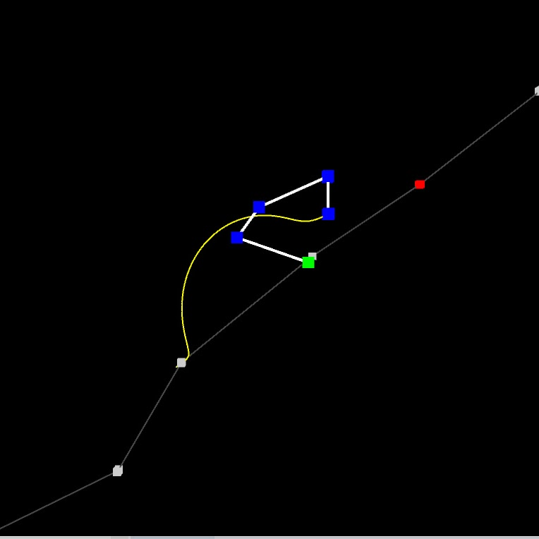
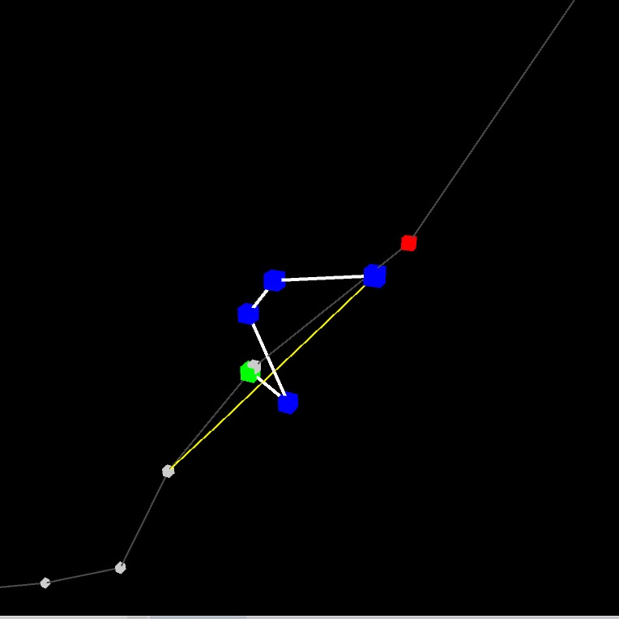
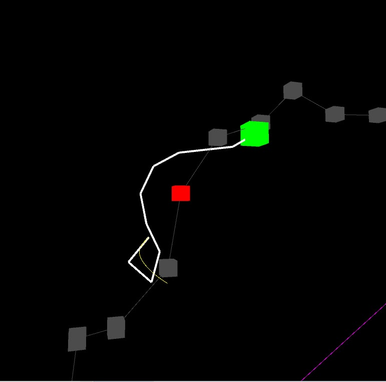
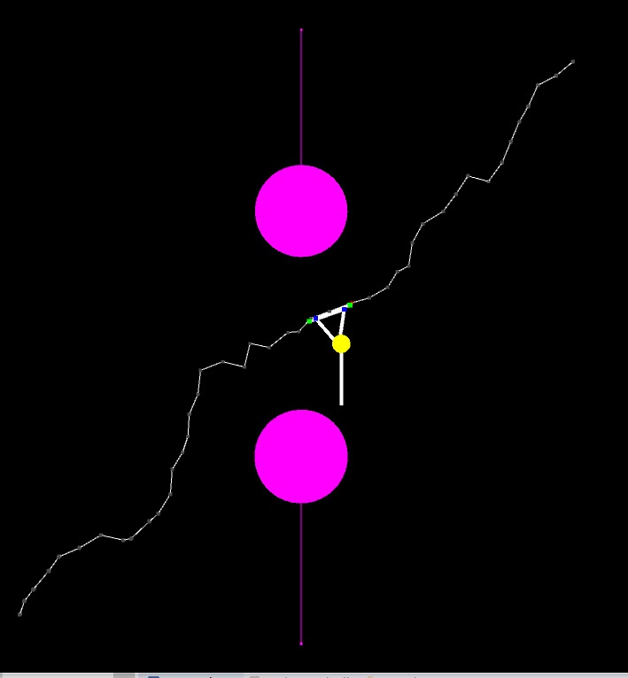
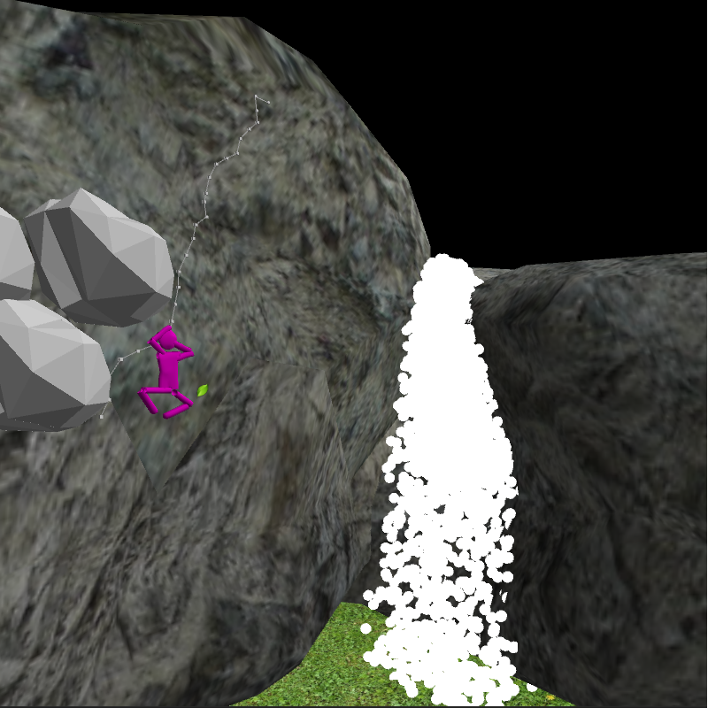
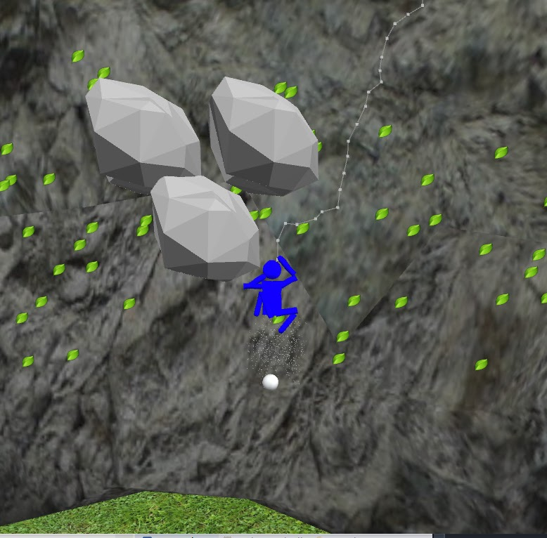

# stick-solo
## description
- Simple planning methods for 2D stick-figure free-solo climbing agents.
- Climbing route is generated by probabilistic roadmap and A\* search.
- Stick figure movements are computed using (analytical/iterative) inverse kinematics.
## code
- Code is written in java, should work with JRE 8+.
    - `src/` contains all source code.
    - `jars/` contain all libraries bundled as jars.
        - `processing` is used as a rendering library.
        - `queasy cam` is used as a camera library.
    - `data/` contains resources such as images, obj, mtl files.
## documentation
- For most of the code, the documentation is itself.
## usage
- Open a terminal at project root (the directory containing this file).
- Use `javac -Xlint:unchecked -cp "jars/processing/*:jars/ejml-v0.39-libs/*:jars/minim/*" -d build/ $(find -name "*.java")` to compile and put all output class files under `build/`.
- Use `java -cp "build/:jars/processing/*:jars/ejml-v0.39-libs/*:jars/minim/*" <package>.<to>.<path>.<class>` to run any simulation.
    - For example `java -cp "build/:jars/processing/*:jars/ejml-v0.39-libs/*:jars/minim/*" demos.serialagent.RRAnalyticalAgentOnPRM`.
- Common controls
    - `w a s d` for basic camera movements.
    - `q e` for camera up and down movements.
    - `p` for pause/play.
- Tested on Ubuntu 18.04
    - If you use a distrubution that uses rolling release cycle (like Arch) you might have to install some older version of JRE and mesa (opensource intel openGL driver) that work with processing library.
## demonstration
The videos demos are compiled into a [playlist](https://www.youtube.com/playlist?list=PLrz4CUP15JSIdKflSZ2yPjDZ0NcWdOUnn).
### videos
The journey from a two-link agent to a human-like agent.

Individual features.

- A 2-link analytical agent.

- A 4-link jacobian transpose (iterative) agent.

- A 4-link pseudo inverse (iterative) agent.

- Simulating worms using large-count-small-length link agents.

- A 2-arm agent.

- A 2-arm 2-leg agent moving up/down/left/right/diagnol directions.

- Race b/w 2-arm 2-leg agents.

- A 2-arm 2-leg agent in the wild (replanning on rock slip, energy depletion, wind, waterfall).

### images
- 4-link agent using jacobian-transpose.

- 4-link agent using pseudo-inverse method.

- Worm agent's tail moving to the red node.

- 2-arm agent avoiding obstacles.

- Simulated waterfall using a particle system.

- Wind effects, leaves and falling stones.

## roadmap
- Problems solved until now are documented in `report.pdf`

### Assumptions
- 2D wall and 2D constrained stick-figure agents
- 2D circle and line segment obstacles on wall

### Stick-figure agent
- A stick-figure agent = rigid links + joints
- Joint = revolute

### Serial stick-figure agent
- Links arranged serially
- N links => N joints => N sized joint tuple => N + 1 ends
- Always one pivot end and one free end

### Basics
- [x] Spherical agent translating on 2D PRM/A* generated path
- [x] RR agent milestone hopping on 2D PRM/A* generated path
    - [x] min/max bounds on PRM neighbours
    - [x] Control joint tuple and goal joint tuple ranges
    - [x] RRIK Jacobian transpose iterative solver
    - [x] RRIK pseudo inverse method iterative solver
- [x] NR agent milestone hopping on 2D PRM/A* generated path
    - [x] Jacobian method
    - [x] Pseudo inverse method

### Humanize
- [x] Two arm agent
- [x] Gravity effect
- [x] Two arm Two leg agent
- [x] Energy spent in some form

### Obstacles
- [x] Spherical obstacles, line segment obstacles
- [x] Slippery holds and rock particle effects
- [x] Re planning on obstacle collision or slipping

### Effects
- [x] Sound
  - [x] On pivot change
  - [x] On slip
  - [x] Environment
- [x] Waterfall
- [x] Wind effects - both in body, particles

### Rendering
- [x] 3D context (holds, trees, waterfall, lavafall, birds) and sounds

### Polishing
- [x] Improve leaf effects especially in with context demo
- [x] Color according to energy, remove energy bar
- [x] Competition b/w agents with slippery holds
- [x] Tune params for Four arm agent demos

- [x] Change ground doesn't go with everything else; make it seem like agent is high above the ground
- [x] Add obstacles
- [x] Improve agent rendering, 3D models for agent links (hands, legs, body and tail)?

- [x] Trail of hand (useful for showing shortest path of pseudo inverse vs jacobian method)
- [x] Worm agent
- [x] Improve colors of water and sky

### Demos
- [x] RRAnalytical demo
- [x] NRIterative agent demos
    - [x] Jacobian vs Pseudo inverse
- [x] Two arm agent demo
    - [x] Climbing up-left, up-right
    - [x] Climbing down-left, down-right
    - [x] Climbing sideways
    - [x] Climbing all in same path
- [x] A demo containing everything

### Future work
- [ ] 2D PRM/A*
    - [ ] Avoid duplication of same start and finish
- [ ] Belay rope
- [ ] Prismatic joints
- [ ] Angle bound obstacles, replanning in known environment
- [ ] Springy limbs
- [ ] Spatial data structures
- [ ] Unknown environment (note: the milestones can't be sampled they are part of environment)
